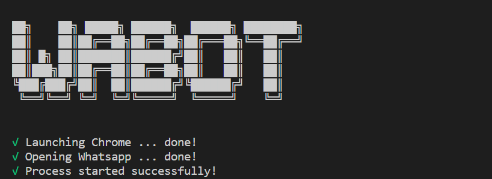

# WABOT!



Wabot is a nodejs module which allows you to connect with whatsapp web by using Puppeteer.

It is not an official whatsapp module so I am not responsible for any ban. Although I have tried a lot and have not been banned, I cannot guarantee that this is the case for everyone or that in the future restrictions will apply to prevent its use.

# Installation

    npm i wabot

NOTE: Node 10.15.0+ is required

## Documentation

You can find all documentation here [Documentation](https://luiscruzga.github.io/wabot/)

## Supported features

| Feature  | Status |
| ------------- | ------------- |
| Send messages  | ✅  |
| Receive messages  | ✅  |
| Send media (images/audio/documents)  | ✅  |
| Send media (video)  | ✅  |
| Send stickers | ✅ |
| Send stickers without background | ✅ |
| Receive media (images/audio/video/documents)  | ✅  |
| Send contact cards | ✅ |
| Send location | ✅ |
| Receive location | ✅ | 
| Message replies | ✅ |
| Join groups by invite  | ✅ |
| Get invite for group  | ✅ |
| Modify group info (subject, description)  | ✅  |
| Add group participants  | ✅  |
| Kick group participants  | ✅  |
| Promote/demote group participants | ✅ |
| Mention users | ✅ |
| Mute/unmute chats | ✅ |
| Get contact info | ✅ |
| Get profile pictures | ✅ |
| Set user status message | ✅ |
| Send Text to Image | ✅ |
| Ban user by spam | ✅ |
| Permission control | ✅ |
| Custom commands | ✅ |
| Valid responses | ✅ |
| Add plugins | ✅ |


## Plugins 

The creation of new plugins is allowed to automate some tasks and achieve incorporation as a new method of the wabot class.

To create a new plugin it is required to export an object with the following properties:

 - **Id**: Plugin identifier (name)
 - **setup**: Initial configuration function with configuration parameters (optional function)
 - **plugin**: Function that contains the actions to be performed by the plugin, this function will have access to all the methods of the wabot function by using "this"

Once the plugin is created, the "plugins" parameter must be configured at the time of instantiating WABOT through intentsConfig, then the possible modules to be used by the plugin must be installed separately through the console by "npm install module_name".

Below is a list of the plugins that come by default incorporated with the module:

| Plugin| Description |
| ------------- | ------------- |
| Anime | Plugin to transform your selfie into an anime portrait using minivision photo2cartoon |
| Cartoon | Plugin to transform your selfie into an cartoon portrait using |
| Coronavirus | Plugin to obtain information on the coronavirus by countries, cases, deaths, etc |
| Music | Plugin to get a song in mp3 format directly from soundcloud |
| Lifehacks | Plugin that allows you to get a video from lifehacks |
| Meme | Plugin that allows you to send various memes from subreddits in Spanish and English |
| Movie | Plugin that allows you to obtain movies to watch online in different qualities |
| News | Plugin to get news from the different rss sources that are configured |
| Translate | Plugin that allows you to translate a text to the language that is requested |
| Wiki | Plugin that allows the search of different things in wikipedia |
| Youtube | Plugin that allows you to search for videos directly from YouTube |
| Zombie | Plugin that allows you to transform your selfie into a zombie |


## Example usage

You can find more examples in the following [link](https://github.com/luiscruzga/wabot/tree/master/example)

```js
const WABOT = require('wabot');

const wabot = new WABOT();

// Default when no assignment is found for the message
wabot.on('message', (res) => {
    if (res.data.type === 'document' || res.data.type === 'video'){
        wabot.sendMessage({
            "idChat": res.data.from,
            "message": `Thanks for your file.`
        });

        wabot.downloadFile(res.data.id)
        .then((file) => {
            console.log('file downloaded...', file);
        })
        .catch((err) => {
            console.log('error downloading file', err);
        })
    } else {
        wabot.sendMessage({
            "idChat": res.data.from,
            "message": `You say: ${res.data.body}`
        });
    }
});

wabot.on('ready', (session) => {
	console.log('READY', session);
    //console.log('Clossing Session');
    //wabot.closeSession();
});

wabot.start(); 
```

## Default Options

Wabot accepts different startup options, then the default options.
**puppeteerConfig**: 
```json
{
	"WAUrl": "https://web.whatsapp.com",
	"viewBrowser": false,
	"opendevtools": false,
	"userAgent": "Mozilla/5.0 (Windows NT 10.0; Win64; x64) AppleWebKit/537.36 (KHTML, like Gecko) Chrome/81.0.4044.92 Safari/537.36",
	"width": 1000,
	"heigth": 800,
	"dowloadChromeVersion": false,
	"chromeVersion": 818858,
	"localChromePath": "C:/Program Files (x86)/Google/Chrome/Application/chrome.exe",
	"getInitScreenshot": false,
    "pathScreenshot": "./screenshot.png",
	"args": [
		"--log-level=3",
		"--no-default-browser-check",
		"--disable-site-isolation-trials",
		"--no-experiments",
		"--ignore-gpu-blacklist",
		"--ignore-certificate-errors",
		"--ignore-certificate-errors-spki-list",
		"--disable-extensions",
		"--disable-default-apps",
		"--enable-features=NetworkService",
		"--disable-setuid-sandbox",
		"--no-sandbox",
		"--disable-infobars",
		"--window-position=0,0",
		"--ignore-certifcate-errors",
		"--ignore-certifcate-errors-spki-list",
		"--disable-threaded-animation",
		"--disable-threaded-scrolling",
		"--disable-histogram-customizer",
		"--disable-composited-antialiasing",
		"--disable-dev-shm-usage",
		"--disable-notifications"
	]
}
```
**intentsConfig**: 
```json
{
	"showContent": false,
	"debug": false,
	"removeBgApis": [],
	"plugins": {
        "folder": "../plugins",
        "plugins": [],
        "setup": {}
    },
	"executions": {
		"reponseUsers": true,
		"simulateTyping": true,
		"timeSimulate": 3000,
		"contorlExecutions": false,
		"maxExecutions": 30,
		"timeInterval": 10,
		"timePending": 3,
		"sendSeen": true,
		"sendSeenFull": false,
		"intervalSendSeen": 10
	},
	"bann": {
		"active": false,
		"timeInterval": 10,
		"maxBann": 3,
		"timeBann": 10,
		"timeInactive": 5,
		"whiteList": []
	},
	"messages":{
		"userBanned": "⛔😡 *We report that you have been temporarily banned for misusing our services * \n _Please try again after {{TIMEBANN}} minutes_ 🤬",
		"groupBanned": "⛔😡 *We report that this group has been temporarily banned for misuse of our services by '{{USER_NAME}}' (+ {{USER_NUMBER}}) * \n _Please try again after {{TIMEBANN}} minutes_ 🤬",
		"privileges": "⛔ *Unfortunately you do not have privileges, contact the system administrator* ⛔"
	},
	"blocked": [],
	"whiteList": [],
	"commands": []
}
```

## Disclaimer

This module is not official WhatsApp so you must be careful with the number of interactions per minute to avoid possible bans, this module has the option of queuing responses to avoid such a situation but does not ensure that actions cannot occur on the part of the company.

This project is inspired by [Wbot](https://github.com/vasani-arpit/WBOT) I just dedicate myself to adding new options to it.