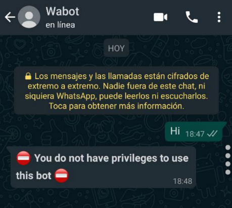
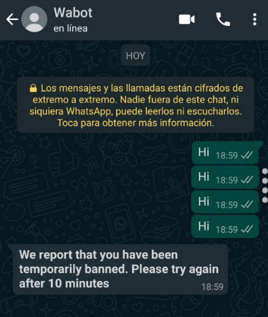
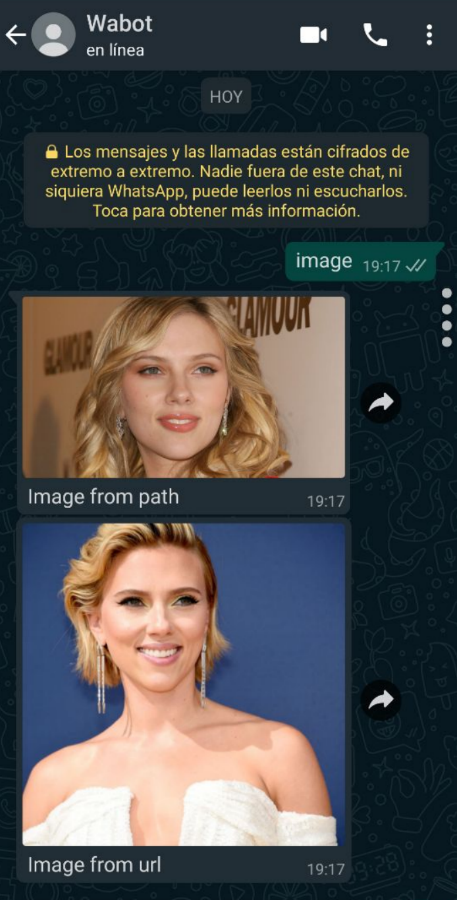
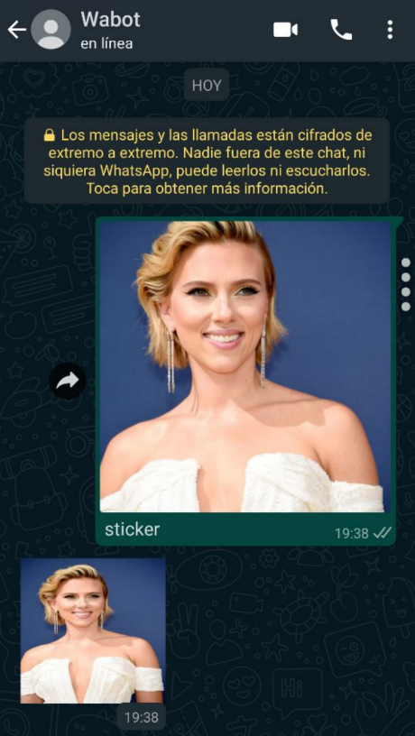
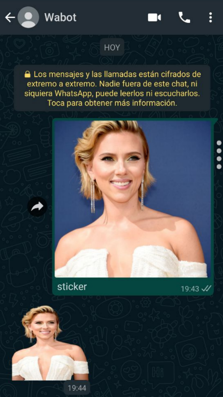
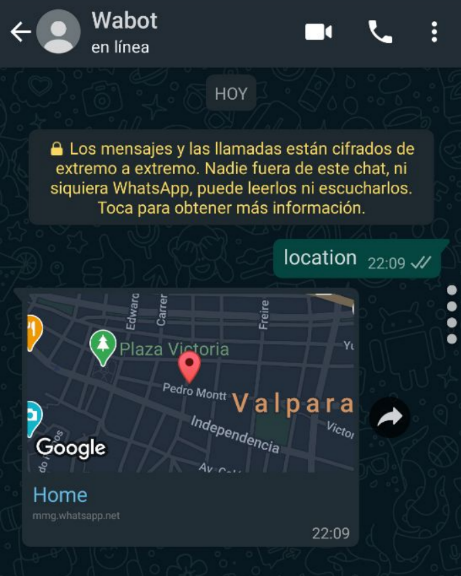
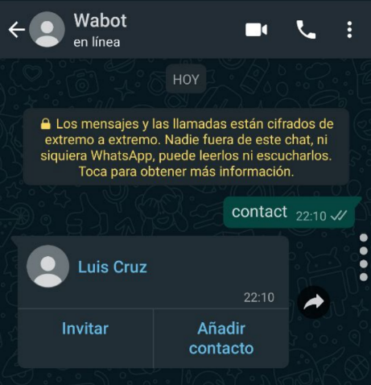
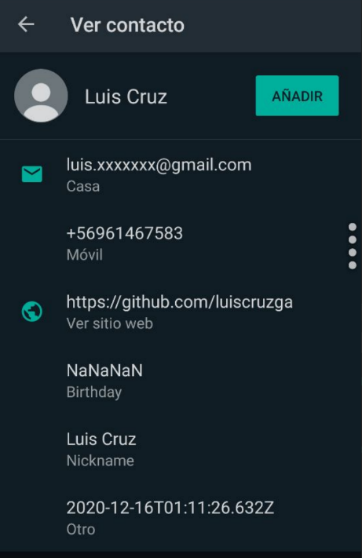

## Examples

There are many options for configuration, below we will detail some examples for basic configuration and quick tests

## No privileges

The application is configured so that only the indicated numbers can use the bot, in case any other number writes to it, it will indicate a message (this message can be modified, in case of indicating an empty message, no message will be sent)

```js
const wabot = new WABOT({
	intentsConfig: {
		whiteList: ["56961464765@c.us"],
		messages: {
			privileges: "⛔ *You do not have privileges to use this bot* ⛔"
		}
	}
});
```



## Block users

You can block numbers to prevent them from using the bot

```js
const wabot = new WABOT({
	intentsConfig: {
		blocked: ["56961464765@c.us"],
		messages: {
			privileges: "⛔ *You do not have privileges to use this bot* ⛔"
		}
	}
});
```


## Temporarily ban users

You can temporarily ban users for suspected spam, you can control the number of messages you want to receive in X amount of seconds, for example: You can configure so that if a user sends more than 3 messages in less than 10 seconds, get banned

```js
const wabot = new WABOT({
	intentsConfig: {
		"bann": {
			"active": true,
			"timeInterval": 10, // time in seconds 
			"maxBann": 3, // maximum number of messages supported in timeInterval seconds
			"timeBann": 10, // maximum number of messages supported in timeInterval seconds
		},
		"message": {
			"userBanned": "*We report that you have been temporarily banned. Please try again after {{TIMEBANN}} minutes*"
		}
	}
});
```



## Send Images 

You can send images either by passing the image path, its http address or as base64

```js
wabot.on('message', (res) => {
	if (res.data.body === 'image') {
        // Send Image from path
        wabot.sendImage({
            "idChat":  res.data.from,
            "caption":  "Image from path",
            "file":  path.join(__dirname, "./img/image0.jpg")
        });

        // Send image from url
        wabot.sendImage({
            "idChat":  res.data.from,
            "caption":  "Image from url",
            "file": "https://cdn-3.expansion.mx/dims4/default/7026739/2147483647/strip/true/crop/763x1024+0+0/resize/1800x2416!/quality/90/?url=https%3A%2F%2Fcdn-3.expansion.mx%2Fbe%2Fee%2Fd232acf4438aa185d2ca23b44cde%2Fgettyimages-1035090740.jpg"
        });
    } else if (res.data.caption === 'image') {
        // Send image base64
        wabot.sendImage({
            "idChat":  res.data.from,
            "caption":  "Image from base64",
            "file": res.media
        });
    }   
});
```



## Send Stickers 

You can transform images into stickers easily

```js
wabot.on('message', (res) => {
	if (res.data.caption === 'sticker') {
        wabot.sendSticker({
            "idChat":  res.data.from,
            "file":  res.media
        });   
    }  
});
```



You can also add your removebg api keys to be able to remove the background from the image automatically

```js
const wabot = new WABOT({
	intentsConfig: {
		removeBgApis: ["2NkJmJPEm4XAeTyvyr554FGHC"]
	}
});
```



## Send Location 

You can send the location easily

```js
wabot.on('message', (res) => {
	if (res.data.body === 'location') {
        wabot.sendLocation({
			"idChat": res.data.from,
			"lat": "-33.0467291",
			"lng": "-71.6169808",
			"title": "Home"
		});
    }  
});
```



## Send Contact 

You can send contacts easily and in a very complete way

```js
wabot.on('message', (res) => {
	if (res.data.body === 'contact') {
        wabot.sendVcard({
			"idChat":  res.data.from,
			"contactName":  "Luis Cruz",
			"vcard": {
				firstName:  "Luis",
				lastName:  "Cruz",
				birthday:  "29-02-1990",
				url:  "https://github.com/luiscruzga",
				nickname:  "Luis Cruz",
				cellPhone:  "+56961467583",
				email:  "luis.xxxxxxx@gmail.com",
				photo:  path.join(__dirname, "test.jpg")
			}
		});
    }  
});
```




## Custom Commands

You can configure your own commands to be triggered when a keyword or phrase is detected

```js
const  WABOT = require('wabot');
const  path = require('path');

const wabot = new WABOT({
	intentsConfig: {
		commands: [
            {
                "name":  "help",
                "contains": [],
                "exact": ["@help", "help", "@commands", "commands", "@command", "command", "what can you do"]
            },
            {
                "name":  "makeJoke",
                "contains": [],
                "exact": ["@joke", "@jokes", "joke", "jokes", "tell me a joke"]
            },
            {
                "name":  "getImage",
                "contains": [],
                "exact": ["@image", "@images", "image", "images", "give me a picture"]
            },
            {
                "name":  "getNews",
                "contains": [],
                "exact": ["@news", "news", "give me news"]
            }
        ]
	}
});

wabot.on('help', (res) => {
	wabot.sendMessage({
	"idChat":  res.data.from,
	"message":  "*This is a help.*"
	});
});

wabot.on('makeJoke', (res) => {
	wabot.sendMessage({
	"idChat":  res.data.from,
	"message":  "This is a joke"
	});
});

wabot.on('getImage', (res) => {
	wabot.sendImage({
	"idChat":  res.data.from,
	"caption":  "This is a image.",
	"file":  path.join(__dirname, "./img/image0.jpg")
	});
});

wabot.on('getNews', (res) => {
	wabot.sendLink({
	"idChat":  res.data.from,
	"caption":  "This is a description",
	"link": "http://feedproxy.google.com/~r/fayerwayer/~3/w3C_M7uD-No/ios-14-punto-verde-o-naranja-en-iphone"
	});
});

wabot.start();
```


