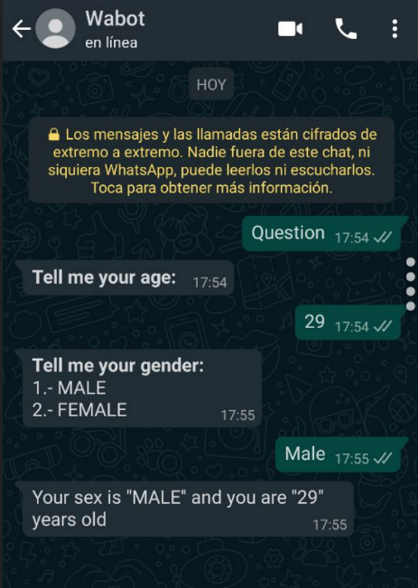
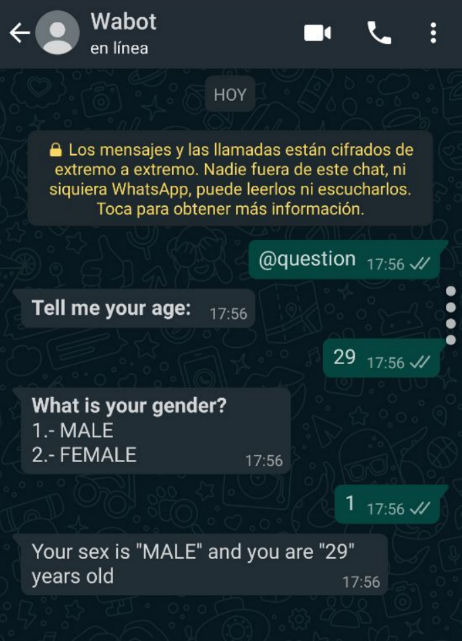
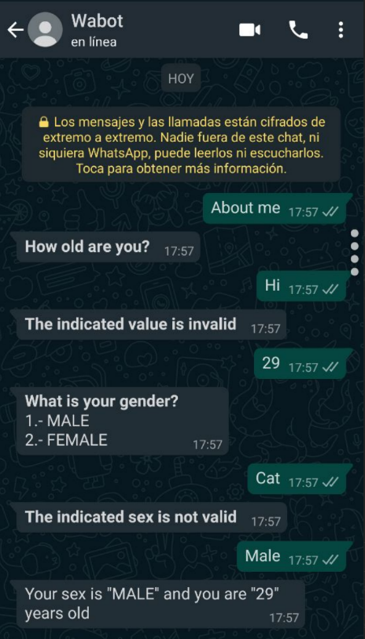

## Params

You can configure your commands in a simple way so that they can be able to request information from the user and once it is provided you can make use of said information directly.

You can configure the command to support different key words or phrases and request the information with the questions you provide

Arrays of string type values ​​support different types of response, it can be the value as you ask in the configuration, the position number, or the value in lowercase / uppercase

The process is responsible for validating that the value provided by the user is correct, in case of specifying that a parameter is of numeric type, only numbers are accepted, and in the case of value arrangement, the value indicated by the user must be Within said arrangement, in case of not being fulfilled, it is requested that a valid value be entered according to the questions provided in the configuration

You can also enter the parameters directly online with the configured word / phrase

In the case of entering the parameters online, it is also validated that all are entered, in case of not being fulfilled, it is requested that those that remain pending are entered

